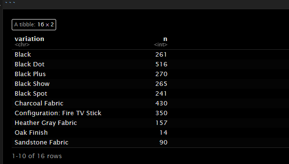

```{r setup, include=FALSE}
knitr::opts_chunk$set(echo = TRUE)
```

```{r 5x5 }
vectorA <- c(1, 2, 3, 4, 5)
matrixA <- matrix(0, nrow = 5, ncol = 5)


for (i in 1:5) {
  for (j in 1:5) {
    matrixA[i, j] <- abs(vectorA[i] - vectorA[j])
  }
}

matrixA
```
```{r asterisk}

for (i in 1:5){
    cat(rep("*",i), collapse = "\n")
    }

```

```{r Fibonacci}

#fib1 <- as.numeric(readline(prompt = "Enter a number to start the Fibonacci sequence: ")) 
#This code above should be the correct code but I am gonna use a value so that I am able to knit 
fib1 <- 1
num1 <- fib1
num2 <- fib1

print(num1)

repeat {
  next_num <- num1 + num2
  if (!is.na(next_num) && next_num > 500) {
    break
  }
  print(next_num)
  num1 <- num2
  num2 <- next_num
}

```

```{r Importing csv file}
ShoeSizeDF <- data.frame(
  Shoe_size = c(6.5,9.0,8.5,8.5,10.5,7.0,9.5,9.0,13.0,
               7.5,10.5,8.5,12.0,10.5,13.0,11.5,8.5,5.0,
               10.0,6.5,7.5,8.5,10.5,8.5,10.5,11.0,9.0,
               13.0),
  
  Height = c(66.0,68.0,64.5,65.0,70.0,64.0,70.0,71.0,
             72.0,64.0,74.5,67.0,71.0,71.0,77.0,72.0,
             59.0,62.0,72.0,66.0,64.0,67.0,73.0,69.0,
             72.0,70.0,69.0,70.0),
  Gender = c("F","F","F","F","M","F","F","F","M","F","M","F",
             "M","M","M","M","F","F","M","F","F","M","M","F",
             "M","M","M","M")
  
)
write.csv(ShoeSizeDF, file = "shoesize.csv", row.names = FALSE)

```

```{r Importing csv file}
shoeSizeCSV <- read.csv("shoesize.csv")
shoeSizeCSV

```

```{r Subsets}
  Fsubset <- subset(shoeSizeCSV, Gender == "F")
  Msubset <- subset(shoeSizeCSV, Gender == "M")
  
 FRowNum <- nrow(Fsubset)
 MRowNum <- nrow(Msubset)
 
 
 cat("Number of observations for Female:", FRowNum,"\n")
 cat("Number of observations for Male:", MRowNum, "\n")
  
```

```{r Plotting}
sexCounts  <- c(FRowNum, MRowNum)
sexLabels <- c("Female", "Male")
plot1 <- barplot(sexCounts, names.arg = sexLabels,
                 main = "Number of Males and Females in Household Data",
                 xlab = "Sex", ylab = "Count",
                 col = c("chartreuse", "azure"),
                 legend.text = sexLabels,
                 args.legend = list(x = "topright", bty = "n")
)

plot1
```
```{r Piechart}
incomeDF <- data.frame(
  Expenses = c("Food", "Electricity", "Savings", "Miscellaneous"),
  Amount = c(60, 10, 5, 25)
)
incomeDF

pie(incomeDF$Amount, labels = incomeDF$Expenses, col = c("red", "green", "yellow", "aquamarine"),
    main = "Distribution of Income")

```

```{r Iris dataset}
str("iris")
cat("data set iris is in character structure")

```

```{r Meandataset}
mean_sepal_length <- mean(iris$Sepal.Length)
mean_sepal_width <- mean(iris$Sepal.Width)
mean_petal_length <- mean(iris$Petal.Length)
mean_petal_width <- mean(iris$Petal.Width)


```

```{r Species pieChart}
species <- table(iris$Species)
pie(species, main = "Species Distribution in Iris Dataset",
    labels = c("Setosa", "Versicolor", "Virginica"),
    col = c("magenta", "springgreen", "yellow"),
    clockwise = TRUE)


```

```{r Species subset}
subset_Setosa <- subset(iris, Species == "setosa")
subset_Versicolor<- subset(iris, Species == "versicolor")
subset_virginica <- subset(iris, Species == "virginica")

last_6_setosa <-tail(subset(iris, Species == "setosa"))
last_6_Versicolor <- tail(subset(iris, Species == "versicolor"))
last_6_virginica <- tail(subset(iris, Species == "virginica"))

last6subsetSpeciesDF <- rbind(last_6_setosa, last_6_Versicolor, last_6_virginica)
last6subsetSpeciesDF
```

```{r Scatterplot for iris }

data(iris)
subiris <- iris[,1:2]

plot(subiris,
     pch = as.integer(iris$Species),
     col = as.integer(iris$Species)+9)
     
```

```{r Factor iris}
IrisFactor <- factor(iris$Species)   
IrisFactor
cat("This will display the character values of the species column and the levels")
```

```{r Alexa files}
library("readxl")
alexaDF <- read_excel("alexa_file.xlsx")

oldName = c("Black  Dot","Black  Plus","Black  Show","Black  Spot","White  Dot", "White  Plus", "White  Show", "White  Spot")
newName = c("Black Dot","Black Plus","Black Show","Black Spot","White Dot", "White Plus", "White Show", "White Spot")
alexaDF$variation <- gsub("Black  Dot","Black Dot",alexaDF$variation)
alexaDF$variation <- gsub("Black  Plus","Black Plus",alexaDF$variation)
alexaDF$variation <- gsub("Black  Show","Black Show",alexaDF$variation)
alexaDF$variation <- gsub("Black  Spot","Black Spot",alexaDF$variation)
alexaDF$variation <- gsub("White  Dot","White Dot",alexaDF$variation)
alexaDF$variation <- gsub("White  Plus","White Plus",alexaDF$variation)
alexaDF$variation <- gsub("White  Show","White Show",alexaDF$variation)
alexaDF$variation <- gsub("White  Spot","White Spot",alexaDF$variation)
                   
alexaDF
```

```{r Knit graphics}

```


```{r total variation}

library("dplyr")
variationCount <- alexaDF %>%
  count(variation)
variationCount
```

```{r Rdata}

save(variationCount, file = "Variations.RData")

```

```{r loading variations}
 load("variations.RData")
```

```{r variations barplot}

BlackVar <- variationCount[1:5,]
WhiteVar <- variationCount[12:16,]

par(mfrow = c(1, 2))


barplot(BlackVar$n, main = "Black Variants",
        xlab = "Variants",
        ylab = "Total Numbers",
        col = c("brown", "cyan", "orange", "#E0FF00", "#FF00C0"),
        names.arg = BlackVar$variation,
        cex.names = 0.35) 


barplot(WhiteVar$n, main = "White Variants",
        xlab = "Variants",
        ylab = "Total Numbers",
        col = c("brown", "cyan", "orange", "#E0FF00", "#FF00C0"),
        names.arg = WhiteVar$variation,
        cex.names = 0.35) 

```